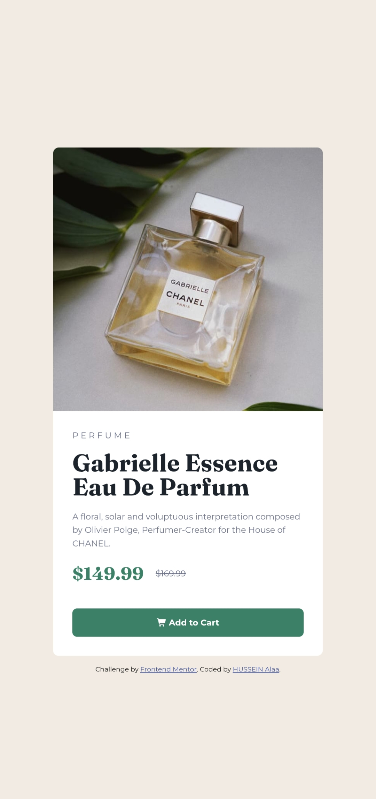

# Product Preview Card Component

هذا الحل الخاص بي لتحدي "Product Preview Card" من منصة **Frontend Mentor**.

## 🖼️ Project Preview

**[🔗 اضغط هنا لمعاينة المشروع مباشرة (Live Demo)](رابط_موقعك_هنا)**

---

## 🚀 1. Overview
* تم بناء هذا المشروع لتقوية مهاراتي في **CSS Flexbox** و **Responsive Web Design**.
* التركيز كان على إنشاء تصميم متجاوب بالكامل ينتقل من تصميم للهواتف (Mobile-first) إلى تصميم محسن للحواسب.

## 🛠 2. Technologies Used
1. **HTML5**
2. **CSS3** (باستخدام Media Queries للتجاوب).
3. **Mobile-first workflow**.

## 💡 3. What I Learned
1. **Deepened Concepts:** كان هذا التمرين نقطة تحول بالنسبة لي، حيث انتقلت من مجرد "اتباع الدروس" إلى فهم كيفية عمل المتصفحات وتفاعل خصائص CSS.
2. **Layout Management:** أتقنت استخدام `display: none` و `display: block` للتحكم في ظهور العناصر حسب حجم الشاشة.
3. **Flexbox Mastery:** اكتسبت فهماً عميقاً لكيفية استخدام Flexbox لإنشاء تصاميم متوازنة ومرنة.
4. **Problem-Solving:** تطورت مهاراتي في تصحيح الأخطاء (Debugging)؛ حيث تعلمت أن أفضل طريقة لحل مشكلة معقدة هي إعادة بناء الهيكل بمنطق أوضح.

## 📱 4. Challenges Encountered & Solutions
1. **The Responsive Hurdle:** في البداية، واجهت صعوبة في جعل الصور تتوافق بشكل صحيح أثناء الانتقال بين شاشات الهاتف والحاسوب.
2. **The Solution:** اتخذت قراراً شجاعاً بمسح الكود وإعادة البدء. هذه العملية ساعدتني على تبسيط هيكل الـ CSS والالتزام بمبادئ الـ Mobile-first، مما أدى إلى نجاح التصميم.

## 🚀 5. Final Thoughts
لقد عزز هذا التحدي ثقتي بنفسي كمطور ويب، ولم يكن الأمر يتعلق فقط بإنهاء المهمة، بل بتعلم كيفية التفكير كـ مطور.
